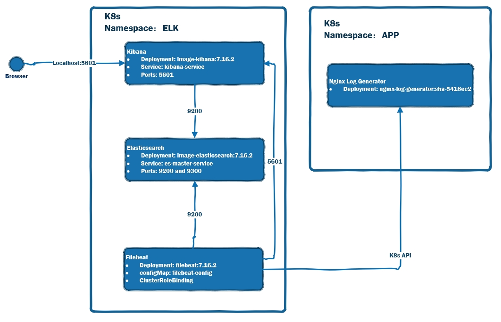

# Install ELK (Elasticsearch, Kibana, and Filebeat) on Minikube 
## Topics
- Demo ENV Detail 
- Target ELK version
- Install ELK on Minikube
- Verify Nginx Access Log in Kibana

## Demo ENV Detail  
- OS version - Oracle Linux Server release 8.4   
  -`cat /etc/oracle-release`
- minikube Version - v1.18.1  
  -`minikube version`   


## Target ELK version
- Version is 7.16.2     
- https://www.docker.elastic.co/ 

## Install ELK on Minikube 



### Install Elasticsearch
- kubectl apply -f es-deployment-service.yaml

```

apiVersion: v1
kind: Namespace
metadata:
  name: elk
---
apiVersion: apps/v1
kind: Deployment
metadata:
  labels:
    node.type: es-node-master
  name: es
  namespace: elk
spec:
  replicas: 1
  selector:
    matchLabels:
      node.type: es-node-master
  template:
    metadata:
      labels:
        node.type: es-node-master
    spec:
      containers:
        - name: es-node-master-container
          env:
            - name: discovery.type
              value: single-node
          image: docker.elastic.co/elasticsearch/elasticsearch:7.16.2
          readinessProbe:
            exec:
              command:
              - curl
              - localhost:9200/_cluster/health
            initialDelaySeconds: 30
            periodSeconds: 10
          livenessProbe:
            exec:
              command:
              - curl
              - localhost:9200/_cluster/health
            initialDelaySeconds: 30
            periodSeconds: 10
          ports:
            - containerPort: 9200
            - containerPort: 9300

---

apiVersion: v1
kind: Service
metadata:
  labels:
    es.service: es-master-service
  name: es-master-service
  namespace: elk
spec:
  ports:
    - name: "9200"
      port: 9200
      targetPort: 9200
    - name: "9300"
      port: 9300
      targetPort: 9300
  selector:
    node.type: es-node-master

  ```
- kubectl port-forward service/es-master-service 9200:9200 -n elk
### Install Kibana

- kubectl apply -f kibana-deployment-service.yaml

```
apiVersion: apps/v1
kind: Deployment
metadata:
  labels:
    node.type: kibana-node
  name: kibana
  namespace: elk
spec:
  replicas: 1
  selector:
    matchLabels:
      node.type: kibana-node
  strategy: {}
  template:
    metadata:
      labels:
        node.type: kibana-node
    spec:
      containers:
        - env:
            - name: ELASTICSEARCH_HOSTS
              value: http://es-master-service:9200
          image: docker.elastic.co/kibana/kibana:7.16.2
          readinessProbe:
            exec:
              command:
              - curl
              - localhost:5601/api/status
            initialDelaySeconds: 30
            periodSeconds: 10
          livenessProbe:
            exec:
              command:
              - curl
              - localhost:5601/api/status
            initialDelaySeconds: 30
            periodSeconds: 10
          name: kibana
          ports:
            - containerPort: 5601


---

apiVersion: v1
kind: Service
metadata:
  labels:
    es.service: kibana-service
  name: kibana-service
  namespace: elk
spec:
  ports:
    - name: "5601"
      port: 5601
      targetPort: 5601
  selector:
    node.type: kibana-node

```

- kubectl port-forward service/kibana-service 5601:5601 -n elk
 ### Install kscarlett/nginx-log-generator
- kubectl apply -f nginx-log-generator-deployment.yaml

```

apiVersion: v1
kind: Namespace
metadata:
  name: app
---
apiVersion: apps/v1
kind: Deployment
metadata:
  labels:
    node.type: nginx-log-generator
  name: nginxloggenerator
  namespace: app
spec:
  replicas: 1
  selector:
    matchLabels:
      node.type: nginx-log-generator
  template:
    metadata:
      labels:
        node.type: nginx-log-generator
    spec:
      containers:
        - env:
            - name: RATE
              value: "10"
          name: nginxloggenerator    
          image: kscarlett/nginx-log-generator:sha-5416ec2

```


### Install Filebeat
- kubectl apply -f  filebeat-deployment.yaml

```
apiVersion: v1
kind: ConfigMap
metadata:
  name: filebeat-config
  namespace: elk
  labels:
    k8s-app: filebeat
data:
  filebeat.yml: |-
    filebeat.autodiscover:
      providers:
        - type: kubernetes
          templates:
            - condition:
                equals: 
                  kubernetes.namespace: app
              config:
                - module: nginx
                  access.input:
                      type: docker
                      containers.ids:
                      - "${data.kubernetes.container.id}"
                      paths:
                        - /var/log/containers/*${data.kubernetes.container.id}.log

    setup.dashboards.enabled: true
    setup.kibana:
      host: "kibana-service:5601"            
    output.elasticsearch:
      hosts: ["es-master-service:9200"]

---
apiVersion: apps/v1
kind: DaemonSet
metadata:
  name: filebeat
  namespace: elk
  labels:
    k8s-app: filebeat
    app: filebeat
spec:
 #replicas: 1
  selector:
    matchLabels:
      k8s-app: filebeat
      app: filebeat
  template:
    metadata:
      labels:
        k8s-app: filebeat
        app: filebeat
    spec:
      serviceAccountName: filebeat
      terminationGracePeriodSeconds: 30
      #hostNetwork: true
      containers:
      - name: filebeat
        image: docker.elastic.co/beats/filebeat:7.16.2
        args: [
          "-c", "/etc/filebeat.yml",
          "-e",
        ]
        securityContext:
          runAsUser: 0
          # If using Red Hat OpenShift uncomment this:
          #privileged: true
        volumeMounts:
        - name: config
          mountPath: /etc/filebeat.yml
          readOnly: true
          subPath: filebeat.yml
        - name: data
          mountPath: /usr/share/filebeat/data
        - name: varlibdockercontainers
          mountPath: /var/lib/docker/containers
          readOnly: true
        - name: varlog
          mountPath: /var/log
          readOnly: true
      volumes:
      - name: config
        configMap:
          defaultMode: 0640
          name: filebeat-config
      - name: varlibdockercontainers
        hostPath:
          path: /var/lib/docker/containers
      - name: varlog
        hostPath:
          path: /var/log
      # data folder stores a registry of read status for all files, so we don't send everything again on a Filebeat pod restart
      - name: data
        hostPath:
          # When filebeat runs as non-root user, this directory needs to be writable by group (g+w).
          path: /var/lib/filebeat-data
          type: DirectoryOrCreate

---
apiVersion: rbac.authorization.k8s.io/v1
kind: ClusterRoleBinding
metadata:
  namespace: elk
  name: filebeat
subjects:
- kind: ServiceAccount
  name: filebeat
  namespace: elk
roleRef:
  kind: ClusterRole
  name: filebeat
  apiGroup: rbac.authorization.k8s.io
---
apiVersion: rbac.authorization.k8s.io/v1
kind: ClusterRole
metadata:
  namespace: elk
  name: filebeat
  labels:
    app: filebeat
rules:
- apiGroups: [""]
  resources:
  - namespaces
  - pods
  - nodes
  verbs:
  - get
  - watch
  - list
---
apiVersion: v1
kind: ServiceAccount
metadata:
  namespace: elk
  name: filebeat
  labels:
    app: filebeat
---

```

- https://www.elastic.co/guide/en/beats/filebeat/current/filebeat-reference-yml.html  
## Verify Nginx Access Log in Kibana
- Stack Management
  - Kibana => Index patterns
  - Data => Index Management
- Analytics
  - Discover
  - Dashboard
## Summary  
- Demo ENV Detail 
- Target ELK version
- Install ELK on Minikube
- Verify Nginx Access Log in Kibana


