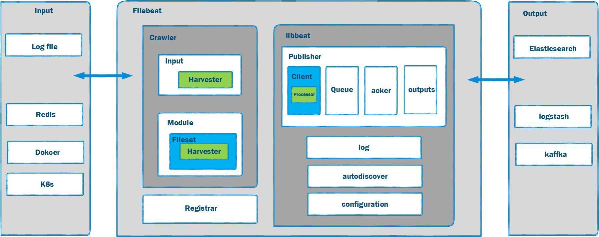

# Filebeat 

## Topics
- What is Filebeat?
- Filebeat Components
- Filebeat Workflow

### What is Filebeat?
Beats are lightweight data  collection  agent beacse it is based Go lunange. 
### Filebeat Components
  

- Crawler 
- Input 
- Harvester
- Module 
- Registrar
- Libbeat
  - Publisher 
    - Client
    - Processor
    - Queue
    - Output
    - Acker 
  - Autodiscover
    - https://www.elastic.co/guide/en/beats/filebeat/current/configuration-autodiscover.html

###  Filebeat Workflow
1. Crawler    
       
2. Input  
    
3. Registrar   
       
4. Harvester   
     
 
5. Module  
   
6. Publisher Client   
    
7. Processor     
   
8. Queue   
       
9. Output   
    
10. Acker    
      

  

## Summary  
- What is Filebeat?
- Filebeat and Libbeat Components
- Filebeat Workflow

