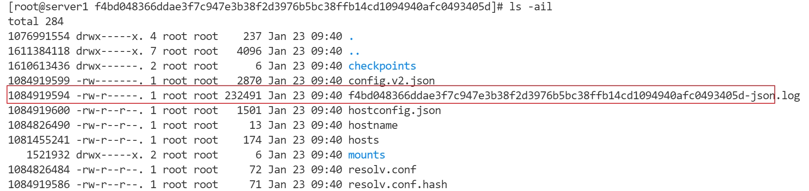
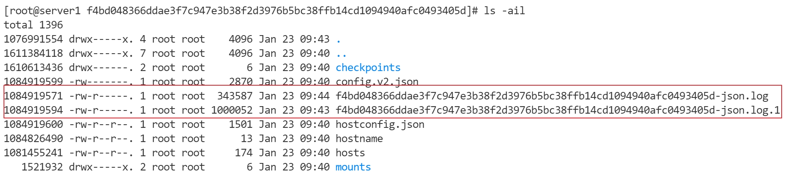
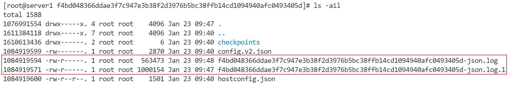

# Filebeat Configuration Top 7 Best Practices

# Background Knowledge - Inode
- 'ls -ail'   
- First Log File - 1084919594
  
- First time log file Rotation  

- Second time log file Rotation


# Config Docker Log File Size
### Docker
vim /etc/docker/daemon.json
```
{
  "log-driver":"json-file",
  "log-opts": {"max-size":"10m", "max-file":"3"}
}
```
## K8s  
``` 
cat /etc/sysconfig/docker
OPTIONS='--log-driver=json-file  --log-opt max-size=50m --log-opt max-file=5'
```

# Log Rotate
Paths: 
- close_inactive: 10m
- scan_frequency: 30s


# Persistency Registry Data
- XXX:/usr/share/filebeat/data:rw

# Reduce Registry Data Size
Paths: 
  - clean_removed:true 
  - clean_inactive: 12m (4m*3 =12m log files get rotated every 4 mins) 
  - ignore_older: 8m (4m*2 =8m log files, get rotated every 4 mins) 


# Reduce Open File Handlers
Paths: 
  - close_renamed: true
  - close_removed: true (default)
  - close_timeout: 6m
  - harvester_limit: (2 * log files number)
  

# Limit CPU Resource 
Global: 
- max_procs: 1
Paths:    
- multiline.max_lines: 200 default is 500


# Configuration Memory Queue
Max Memory = max_bytes * events 
Paths: 
 - max_bytes: 20480

```
queue.mem:  
  events: 2048  (def)
  flush.min_events: 512      
```

# Example Filebeat Configuration File

Summary:
- 7 Best Practices
- Run lond testing with APP log debug and info level to find parameter's value
- Different APPs, different filebeat configuration 
- filebeat.autodiscover Limitation 


