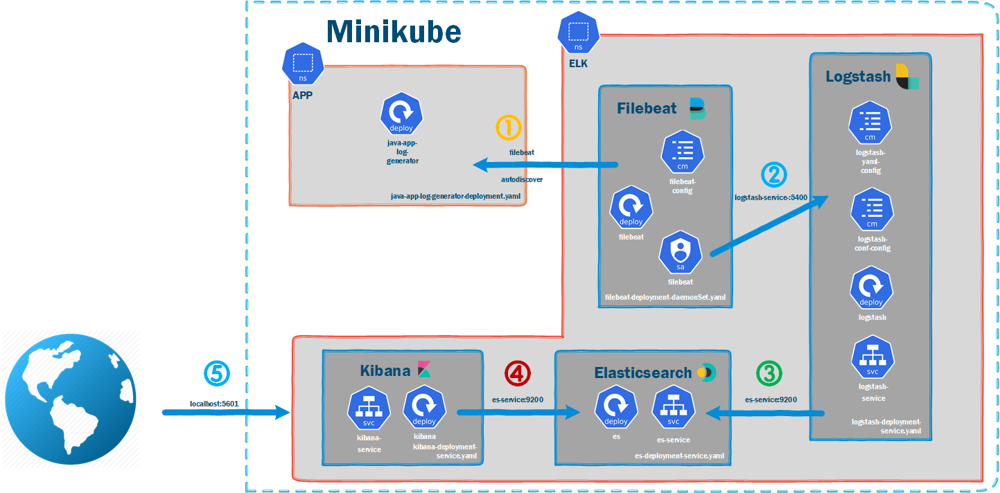

# 1-9 How to Install Elasticsearch,Kibana,Logstash,Filebeat and Java App on Minikube
## Topics
- Demo ENV Detail 
- Target ELK version 
- System Overview  
- Install Elasticsearch,Kibana,Logstash,Filebeat and Java App on Minikube 
- Verify Java App Log in Kibana  

## Demo ENV Detail  
- OS version - Oracle Linux Server release 8.4   
  -`cat /etc/oracle-release`
- minikube Version - v1.18.1  
  -`minikube version`   
- Visual Studio Code Kubernetes Tools v1.3.6
## Target ELK version
- Version is 7.17.0     
- https://www.docker.elastic.co/ 

##  System Overview   
### Minikube
  

## Install Elasticsearch,Kibana,Logstash,Filebeat and Java App on Minikube

### ES
```
kubectl apply -f es-deployment-service.yaml
kubectl port-forward service/es-service 9200:9200 -n elk
```
### Kibana
```
kubectl apply -f kibana-deployment-service.yaml
kubectl port-forward service/kibana-service 5601:5601 -n elk
```
### Java App
```
kubectl apply -f java-app-log-generator-deployment.yaml
```
### Logstash
```
kubectl apply -f logstash-deployment-service.yaml
kubectl port-forward service/logstash-service 5400:5400 -n elk
```
### Filebeat
```
kubectl apply -f filebeat-deployment-daemonSet.yaml
```

## Verify Java App Log in Kibana
- Stack Management
  - Kibana => Index patterns
  - Data => Index Management
- Analytics
  - Discover
  - Dashboard
## Summary  
- Demo ENV Detail 
- Target ELK version 
- System Overview  
- Install Elasticsearch,Kibana,Logstash,Filebeat and Java App on Minikube  
- Verify Java App Log in Kibana  


